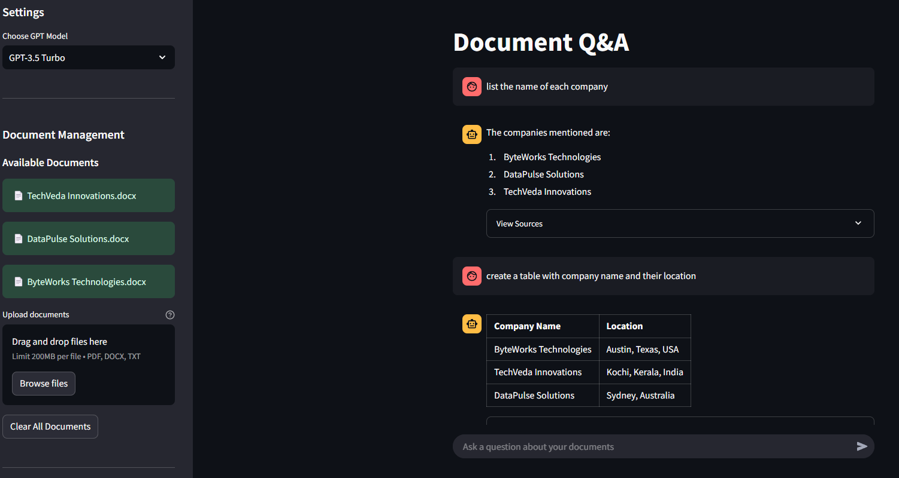
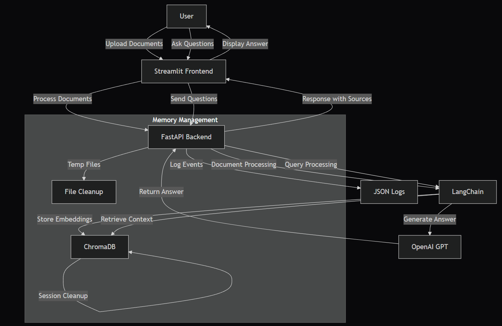

# RAG-AI-Document-Chat
A document Q&amp;A system using FastAPI, Streamlit, and LangChain. Upload multiple documents (PDF, DOCX, TXT) and ask questions using GPT models. Features include source attribution, session management, intelligent memory handling, and detailed logging. Built with ChromaDB for efficient document processing.

# Document Q&A with LangChain and GPT

An interactive document question-answering system built with FastAPI, Streamlit, and LangChain. The application allows users to upload multiple documents (PDF, DOCX, TXT) and ask questions about their content, leveraging GPT models for accurate responses.

## System Interface

## Flow Diagram  

## Key Features
- Multi-document upload and processing
- Real-time Q&A with source attribution
- Support for GPT-3.5 and GPT-4 models
- Session-based document management
- Intelligent memory management:
  - Automatic session cleanup
  - Vector store reset between sessions
  - Temporary file handling
  - Chat history persistence
- Dark mode interface
- Detailed JSON logging system
- Source verification for answers

## Tech Stack
- Backend: FastAPI, LangChain, ChromaDB
- Frontend: Streamlit
- Models: OpenAI GPT
- Vector Store: ChromaDB for efficient document embedding
- Document Processing: PyPDF, Docx2txt
- Memory Management: Session-based with ChromaDB persistence

## Memory Management
- Automatic cleanup of vector store between sessions
- Temporary file handling for document processing
- Session state management for chat history
- Efficient document chunking and embedding
- Source document tracking and verification

## Flow Diagram  

